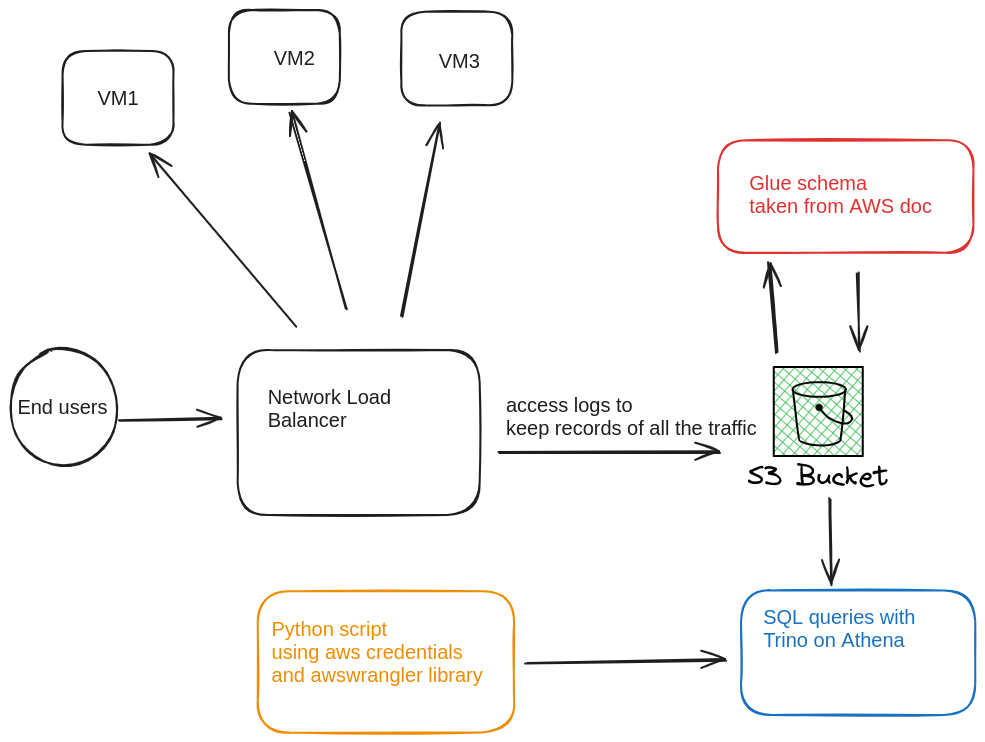

# 📈 AWS Athena Analysis of Load Balancer Traffic

## 🎯 Objective
The goal of this project is to **analyze traffic patterns** on a **Network Load Balancer (NLB)** by querying **AWS Athena** to understand where traffic spikes originate.

## 📝 Project Overview
This project involves the analysis of load balancer access logs stored in **Amazon S3**, with the logs being queried through **AWS Athena**. The analysis aims to uncover the sources of traffic spikes and provide insights into traffic behavior.

## 📊 Traffic Flow Diagram
Below is a diagram representing the flow of traffic and log data from **end-users** to **S3** and **Athena** for analysis.

## 🌐 Traffic Analysis
The first part of the analysis focuses on **traffic patterns**, such as:
- Identifying target port receiving the highest traffic.
- Identifying the domain name receiving the highest traffic.
- Identifying IP addresses generating the highest traffic.
- Identifying IP addresses generating the highest traffic with the biggest connection time. 

## 🚀 Tools & Technologies
- **AWS Athena**: Used to query access logs stored in S3, allowing efficient analysis of large datasets.
- **AWS S3**: Stores access logs generated by the load balancer for long-term retention.
- **awswrangler**: Python library used to interact with AWS services, particularly for querying Athena.
- **Network Load Balancer (NLB)**: The entry point for user traffic, which distributes it across target resources.

## 📈 Results & Insights
#### Compare results before and during the issue 

- We identified four ips which where part of the 30 more actives ips and moreover had a TCP connection duration bigger than 5 minutes.
- From our internal database we identified that those ips where owned by the client XXX and start a discussion with this client to understand why so many long queries where coming from those ips. 

---

## 📬 Get in Touch
If you have any questions or would like to collaborate, feel free to reach out!

- [LinkedIn](https://www.linkedin.com/in/matar-c%C3%A9line-7132bb8b/)
- [Email](mailto:celinematar24@gmail.com)

---

⭐️ If you found this project helpful, consider giving it a star!
